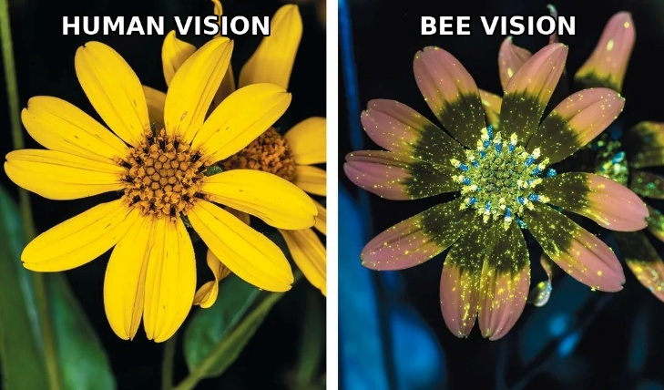
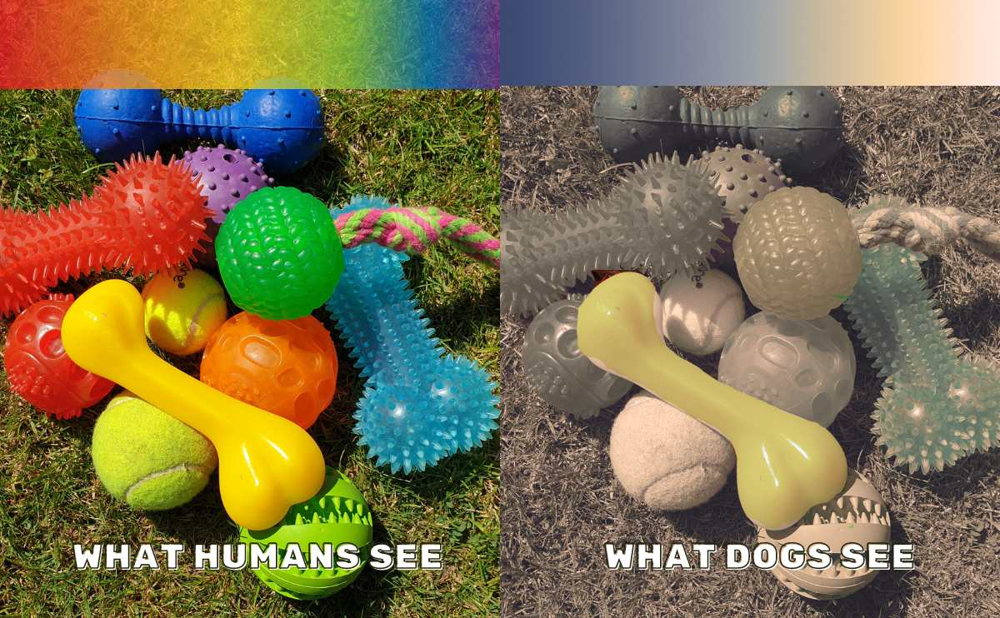

The blue of the sky is not in the sky. It is in your head.

And if that is true of blue – what else, among the things you are sure are “out there,” is actually “in here”?

Let us begin with color, because it is the sharpest example. We speak of the redness of a rose and the blue of the sky as though they belonged to the things themselves. But there is no red and no blue out there. There is light at different wavelengths; some is absorbed, some reflected and strikes the retina, and the brain turns that otherwise meaningless signal into what we call “color.”

Beau Lotto, a neuroscientist who has studied color perception for most of his life, puts it plainly: “Color does not exist. It is a creation of your brain.”[^1]

Red simply does not exist out there – it is something that happens inside our heads, which we project onto the world. A small change in the sensory apparatus, and the entire experience of color changes with it.

If color perception arises from our biological structure, then it does not belong to objects. If every human being had been colorblind from birth, there would be no blue skies in the human world. The skies would not change; only their translation would. Color, then, is not “out there,” a property of things themselves. It is within us. It is our interpretation.

Of course, even if the color of the rose is subjective – the rose itself is there. It has shape, it has weight, and it is real. Something is there, and I am not claiming there is nothing. The claim is that the properties we experience are not necessarily properties of the thing in itself. And if color, which seems so certain, turns out to be merely a subjective interpretation – a translation that takes place within us – on what basis do we assume that all our other experiences – weight, texture, smell, or the sense of solidity – differ from it in kind? They all reach us through the same sensory interface, and none of them has a bypass route to the thing in itself.

Think of a flower. To us, it is color and scent. To a bee, it is a pattern of ultraviolet light for which we do not even have a name. To a bat, it is an acoustic signature in space. To a dog, it is a tapestry of smells. The same flower – and wholly different worlds of appearance. One object, infinitely many interpretations: every organism interprets it through its senses. So what is the flower itself – not to the human eye, not to the bee or the bat, but as it is apart from every point of view? So long as the answer changes with the kind of eye, it is not an answer about the flower. It is an answer about the one asking.

And if there is truth – truth in the full sense – it must be what does not change with the kind of eye, with culture, or with point of view. But that is precisely what the senses cannot give us. Here we need to stop at the root of the matter. Our senses and nervous system did not evolve to provide us with truth about the world; they evolved to increase our chances of survival. The survivor was not the one who saw the world correctly, but the one who saw it in a way that improved the odds of living: fast enough, usable enough, good enough to escape a predator and find food. Usefulness and truth are not the same, and there is no guarantee that a mechanism tuned for the first will lead to the second. The conclusion is this: the senses are not a transparent window onto reality; they are a survival interface – a filtered representation that lets us function, not a faithful description of existence.

\
*(Acoustic simulation of bat echolocation)*

Something deeper follows. If experience is a translation, it necessarily comes after something: there is something being translated, and the translation is not identical to its source. Experience, then, is not the ground – it is an outcome. But this is not only an abstract claim: the senses themselves cannot show us what lies outside their range. They have never told us what they miss. Revealing their blindness requires something else entirely.

Tooby and Cosmides, cognitive scientists, described this precisely: “Far from being a physical property, color is a **mental property** – a useful invention computed by specialized circuits in our brains and then ‘projected’ onto our perceptions of colorless objects... Because these inference engines operate automatically, we mistake the representations they construct for the world itself.”[^2]

What is true of vision is true of every sense. Our hearing covers a narrow band of a vast spectrum; there are sounds we will never hear, smells we will never smell, colors we will never see. Vision, which we trust more than anything else, misleads us routinely and is therefore the source of many optical illusions: a straight stick appears bent in water, a stationary shape seems to move, depth is perceived where none exists.

For thousands of years, people believed that the only light that existed was the light the eye could see. Maxwell’s mathematics showed otherwise: visible light is only a narrow band within a vast electromagnetic spectrum, and it predicted invisible waves that no one had yet discovered. Radio waves were detected experimentally only about two decades later – exactly as the equations required. What pointed to their existence was not a sharper eye or a new sense. It was **reason and logic**. Mathematics pointed to what no eye had seen.

And this was not a single case. When Uranus’s orbit deviated from what calculation predicted, no one set out to scan the sky through a telescope. Two mathematicians sat down with pencil and paper and calculated where another planet would have to be, whose gravity would account for the deviation. When the telescope was finally aimed at the point reason had indicated, Neptune was there. Reason reached the truth before the eye saw it.

An empiricist critic may argue that, in the end, Maxwell and Neptune were confirmed through observation – it was the senses, amplified by instruments, that decided the matter. But notice the order. Observation came afterward. It confirmed what reason had already grasped. Reason pointed to the unseen, and the eye went out to verify it. This reverses the relationship: between reason and the senses, which is the witness and which is the judge?

The senses are not useless, of course. To know whether there is a duck on the lake, I have to look at the lake; for that, they are an excellent tool. Science extends them enormously: a microscope, telescope, scanner, and measuring instrument let us see far beyond the naked eye. But extending the senses does not dissolve the problem – it merely moves it one level forward. A measuring instrument, too, gives us data within a framework of interpretation; it tells us how a thing behaves and what relations it bears, not what the thing is in itself. There is, then, a difference between measuring a phenomenon and deciding its fundamental status. An experiment can measure mass, charge, or brain activity – but it cannot by itself decide what matter is, why neural activity is accompanied by inner experience, or why there is a law-governed world at all. In these questions, observation does not disappear; it simply ceases to be the only judge. It brings evidence – and reason determines what that evidence can, and cannot, prove.

From this point on, experience can no longer be granted foundational status. It is only the first layer we must pass through. And the question remains, a question experience itself is unable to answer: if what we perceive is a translation, what is being translated? What casts the shadow?

That is for the posts ahead.

[^1]: Original Beau Lotto quote: “A color only exists in your head… There’s such a thing as light. There’s such a thing as energy. There’s no such thing as color.” In an interview with PBS. A later 2017 interview with National Geographic reinforces the point: “Red doesn’t exist… These are all things inside our heads that we project out into the world.” That is, red does not exist as a thing in the external world; it is an experience in the mind that we project onto the world.

[^2]: From the introduction to Simon Baron-Cohen’s *Mindblindness*.
