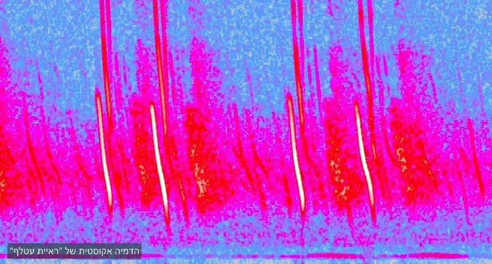

הצבע הכחול של השמיים איננו בשמיים. הוא אצלכם בראש.

ואם זה נכון לכחול – מה עוד, מכל מה שאתם בטוחים שהוא "שם בחוץ", נמצא בעצם "כאן בפנים"?

נתחיל בצבע, מפני שהוא הדוגמה החדה ביותר. אנחנו מדברים על האדמומיות של השושנה ועל הכחול של השמיים כאילו הם שייכים לדברים עצמם. אבל שם בחוץ אין אדום ואין כחול. יש אור באורכי גל שונים; חלקו נבלע, חלקו מוחזר ופוגע ברשתית, והמוח הוא שמלביש על האות חסר־המשמעות הזה את מה שאנו מכנים "צבע".

ביו לוטו, נוירולוג שחוקר את תפיסת הצבע מרבית חייו, אומר זאת בלי כחל ושרק: "צבע לא קיים. הוא יצירה של המוח שלך[^1]". האדום פשוט איננו קיים שם בחוץ – הוא דבר שקורה בתוך הראש שלנו, ואנחנו מקרינים אותו החוצה אל העולם. שינוי קטן במבנה הקולט, וכל חוויית הצבע משתנה יחד אתו.

אם תפיסת הצבע נובעת מן המבנה הביולוגי שלנו, אין היא שייכת לעצמים. אילו היו כל בני האדם עיוורי צבעים מלידה, לא היו שמיים כחולים בעולם האנושי. השמיים לא היו משתנים; רק התרגום שלהם היה משתנה. לכן, צבע איננו "שם בחוץ", תכונה של הדברים עצמם, אלא הוא בתוכנו. פרשנות שלנו.

כמובן, גם אם הצבע של השושנה סובייקטיבי – השושנה עצמה נמצאת שם. יש לה צורה, יש לה משקל וממשות. משהו אכן נמצא שם, ואינני טוען שאין כלום. הטענה היא שהתכונות שאנו חווים אינן בהכרח תכונות של הדבר כשלעצמו. ואם הצבע, שנדמה ודאי כל כך, מתגלה כסך הכל פרשנות סובייקטיבית, כתרגום שמתרחש בתוכנו – מה הבסיס להניח ששכל שאר החוויות שלנו – המשקל, המרקם, הריח או תחושת המוצקות שונים ממנו במהותם? כולם מגיעים אלינו דרך אותו ממשק חושי, ולאף אחד מהם אין מסלול עוקף אל הדבר כשהוא לעצמו.

חשבו על פרח. עבורנו הוא צבע וריח. עבור דבורה הוא דגם של אור אולטרה־סגול שאין לנו אפילו שם בשבילו. עבור עטלף הוא חתימה אקוסטית במרחב. עבור כלב הוא מארג של ריחות. אותו פרח – ועולמות שונים לחלוטין של הופעה. אובייקט אחד, ואינסוף פרשנויות, כל אורגניזם מפרש אותו לפי חושיו. אז מהו הפרח עצמו – לא לעין האנושית, לא לדבורה ולא לעטלף, אלא כפי שהוא מנותק מכל נקודת מבט? כל עוד התשובה משתנה עם סוג העין, היא איננה תשובה על הפרח. היא תשובה על מי ששואל.

ואם יש אמת – אמת של ממש – היא חייבת להיות מה שאינו משתנה עם סוג העין, עם התרבות או עם נקודת המבט. אבל בדיוק את זה החושים אינם יכולים לתת. וכאן צריך לעצור על שורש העניין. החושים ומערכת העצבים שלנו לא התעצבו לאורך האבולוציה כדי לספק לנו אמת על העולם; היא התעצבה כדי להגדיל את סיכויינו לשרוד. מי ששרד אינו מי שראה את העולם נכון, אלא מי שראה אותו באופן שמעלה את סיכויי החיים: מהר מספיק, שמיש מספיק, טוב מספיק כדי לברוח מטורף ולמצוא מזון. תועלת ואמת אינן אותו דבר, ואין שום ערובה שמנגנון שכוּונן לראשונה יוליך גם לשנייה. המסקנה: החושים אינם חלון שקוף אל המציאות; הם ממשק הישרדותי – ייצוג מסונן שמאפשר לנו לתפקד, לא תיאור נאמן של הקיום.

ומכאן נובע דבר עמוק יותר. אם החוויה היא תרגום, היא באה בהכרח אחרי משהו: יש דבר־מה שמתורגם, והתרגום אינו זהה למקור. החוויה, אם כן, איננה הקרקע – היא תוצר. אבל זו אינה רק טענה מופשטת: החושים עצמם אינם יכולים להראות לנו מה נמצא מחוץ לטווח שלהם. הם לא הודיעו לנו מעולם מה הם מחמיצים. נדרש משהו אחר לגמרי כדי לחשוף את העיוורון שלהם.

טובי וקוסמידס, חוקרי קוגניציה, תיארו זאת במדויק: "*רחוק מלהיות תכונה פיזית, צבע הוא **תכונה מנטלית** – המצאה שימושית שמעגלים מתמחים במוחנו מחשבים ואז 'משליכים' על תפיסותינו של עצמים חסרי צבע... מכיוון שמנועי היסק אלו פועלים באופן אוטומטי, אנו טועים לחשוב שהייצוגים שהם בונים הם העולם עצמו*[^2].".

מה שנכון לגבי ראייה, נכון לכל החושים. השמיעה שלנו מכסה רצועה צרה מתוך ספקטרום עצום; יש קולות שלא נשמע לעולם, ריחות שלא נריח, צבעים שלא נראה. הראייה, שעליה אנו סומכים יותר מכול, מטעה אותנו בשגרה ולכן היא מקור לאשליות אופטיות רבות: מקל ישר נראה שבור במים, צורה נייחת נראית נעה, עומק נתפס במקום שאין בו.

במשך אלפי שנים האמינו בני האדם שהאור היחיד הקיים הוא זה שהעין רואה. המתמטיקה של מקסוול הראתה אחרת: שהאור הנראה אינו אלא רצועה צרה בתוך ספקטרום אלקטרומגנטי עצום, וניבאה גלים בלתי־נראים שאיש טרם גילה. גלי הרדיו אותרו בניסוי רק כעבור כשני עשורים – בדיוק כפי שהמשוואות חייבו. מה שהצביע על קיומם לא היה עין חדה יותר ולא חוש חדש. היה זה **השכל, ההיגיון**. המתמטיקה הצביעה על מה שאף עין לא ראתה.

וזה אינו מקרה יחיד. כשמסלולו של אורנוס סטה ממה שהחישוב ניבא, איש לא יצא לסרוק את השמיים בטלסקופ. שני מתמטיקאים ישבו עם עיפרון ונייר וחישבו היכן חייב להימצא כוכב לכת נוסף שכבידתו מסבירה את הסטייה. כשכיוונו לבסוף את הטלסקופ אל הנקודה שההיגיון הצביע עליה, נפטון היה שם. השכל הגיע אל האמת לפני שהעין ראתה אותה.

מתנגד אמפיריציסט עשוי לטעון כי בסופו של דבר אישרנו את מקסוול, ואת נפטון, בתצפית – החושים, מוגברים במכשירים, הם שהכריעו. אבל שימו לב לסדר. התצפית באה אחר כך. היא אישרה את מה שהשכל כבר הבין. השכל הצביע על הבלתי־נראה, והעין יצאה לאמת אותו. וזה הופך את היחס על פיו: בין השכל לחוש, מי כאן העד ומי השופט?

החושים, כמובן, אינם חסרי ערך. כדי לדעת אם יש ברווז על האגם – אין לי אלא להביט באגם, ולשם כך הם כלי מצוין. גם המדע מרחיב אותם בעוצמה: מיקרוסקופ, טלסקופ, סורק ומכשיר מדידה מאפשרים לנו לראות הרחק מעבר לעין העירומה. אבל הרחבת החושים אינה מבטלת את הבעיה – היא רק מסיטה אותה רמה אחת קדימה. גם מכשיר מדידה מוסר לנו נתונים בתוך מסגרת פירוש; הוא אומר איך הדבר מתנהג ואילו יחסים הוא מקיים, לא מהו הדבר כשלעצמו. ולכן יש הבדל בין מדידה של תופעה לבין הכרעה על מעמדה היסודי. ניסוי ימדוד מסה, מטען או פעילות מוחית – אך לא יכריע לבדו מהו חומר, מדוע פעילות עצבית מלוּוה בחוויה פנימית, או למה בכלל יש עולם הניתן לחוק. בשאלות האלה התצפית אינה נעלמת; היא פשוט מפסיקה להיות השופטת היחידה. היא מביאה ראיות – וההיגיון הוא שקובע מה הן מסוגלות, ומה אינן מסוגלות, להוכיח.

מרגע זה אי אפשר עוד להעניק לחוויה את מעמד היסוד. היא רק השכבה הראשונה שיש לעבור דרכה. ונותרת השאלה שהחוויה עצמה מנועה מלענות עליה, אם מה שאנו תופסים הוא תרגום – מהו הדבר שמתורגם? מה מטיל את הצל?

על כך בפוסטים הבאים.

[^1]: הציטוט המקורי של ביו לוטו: **"A color only exists in your head**... There's such a thing as light. There's such a thing as energy**. There's no such thing as color."** [בראיון ל-PBS](https://www.pbs.org/newshour/science/that-dress-isnt-blue-or-gold-because-color-doesnt-exist). יש גם חיזוק מאוחר יותר בראיון של לוטו ל־National Geographic ב־2017, שבו הוא אומר: "Red doesn't exist... These are all things inside our heads that we project out into the world." כלומר: אדום לא קיים כדבר בעולם החיצוני; זו חוויה בראש שאנו "משליכים" על העולם.

[^2]: מתוך ההקדמה לספר "עיוורון תודעתי" מאת סיימון בארון־כהן.
